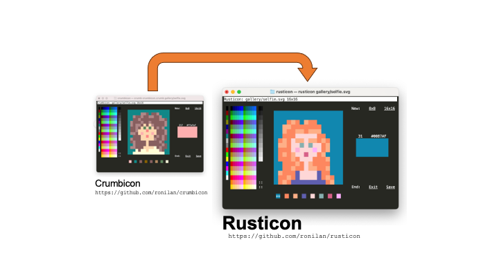

# From Crumbicon to Rusticon

Rusticon is a Rust-based port of [Crumbicon](https://github.com/ronilan/crumbicon), originally written in the [Crumb programming language](https://github.com/liam-ilan/crumb). It replicates the same functionality and user experience (and then extends it a little). 

<p align=center></p>


Below is a brief recap of the porting task from a technical perspective.

## Overview

The two programming languages, Crumb and Rust, are not very much alike.  

> **Crumb** is: *"a high-level, functional, interpreted, dynamically typed, dynamically scoped, general-purpose programming language, with a terse syntax and a verbose standard library."*  

> **Rust** is: *"a high-level, statically typed, compiled, general-purpose programming language with a strong emphasis on safety and performance, featuring expressive syntax, modern concurrency primitives, and a robust standard library."*

One distinction stands out: Crumb is **dynamically scoped**, a rarity among programming languages. It is also purely functional and forbids side effects (other than I/O). These two attributes make writing Crumb programs “different from normal.” While Crumb is a very simple language, working with it requires carefully crafting the code. Writing the original Crumbicon application in Crumb was therefore quite a laboring task.

The idea behind this little project was to take something hand-crafted for one very specific, somewhat obscure world, and see if it could be adapted to a completely new one—while maintaining an identical look-and-feel and keeping the internals as similar as possible.

## Architecture

Crumbicon was built on top of three "usables" (Crumb’s equivalent of packages):  

- **[colors.crumb](https://github.com/ronilan/colors.crumb)** — basic terminal styling functions plus RGB, HEX, and ANSI conversion  
- **[event-loop.crumb](https://github.com/ronilan/event-loop.crumb)** — a basic event loop  
- **[tui.crumb](https://github.com/ronilan/tui.crumb)** — an element-based declerarive reactive TUI framework (still WIP)

```
Application <--> TUI <--> Event Loop
      ^
Terminal Formatting
```

To keep the port simple, Rusticon preserves the same architecture with strict separation between the Application and the upstream TUI and Event Loop. While simple does not always mean easy, implementing this turned out to be fairly straightforward.

### Terminal Formatting

Color conversion and terminal formatting are utilities with a clear spec. In Crumb, the lack of built-in mathematical functions (e.g., base conversion) made implementing these a [little more interesting](https://github.com/ronilan/colors.crumb/blob/main/colors.crumb#L18). The functionality was designed around the needs of the TUI: formatting strings, arrays, and 2D arrays.  

In Rusticon, this role is handled by the [`terminal_style`](https://crates.io/crates/terminal_style) crate, which provides [nearly identical functionality](https://github.com/ronilan/terminal_style). The crate exposes a `Stylable` trait, which defines a standard way to apply transformations or styles to strings. This is then later used by the TUI.

### Event Loop

The Crumb event loop builds on Crumb’s native `event` and `until` functions. It provides an abstraction over keypress and mouse events, and supports five event types: **state**, **loop**, **keypress**, **mouse move**, and **mouse click**.

The loop works with an array of listeners passed at initialization. In Crumb, each listener is represented as a list of five functions in a fixed order. The functions are optional, meaning a listener may include any or none.

The following is a logical representation of a single listener with the internal functions in the order in which they are called:

```
[
  function on_loop (optional)
  function on_keypress (optional)
  function on_click (optional)
  function on_move (optional)
  function on_state (optional)
]
```

To achieve the same in Rust, listeners are represented as a mutable slice of `Listener` structs, each containing the five callback fields.

In Crumb, the loop itself is an `until` loop. It actively tracks state and exits when the state changes to a specific value set by the user. In Rust, the loop is a `while` loop with an explicit exit flag. In Crumb, the state could be voided at any point to cause exit. Mimicking this pattern in a statically typed language would be cumbersome for the user. Instead, Rusticon provides a default exit mechanism (`Ctrl+C`) and accepts an [optional custom exit](https://github.com/ronilan/rusticon/blob/main/src/event_loop.rs#L231-L238).

The native Crumb `event` is synchronous: it halts the loop for a specified duration, resuming only when a key or mouse event occurs or when the timeout expires. The captured event is "raw" and includes escape sequences. Parsing those escape codes into higher-level event handler calls was the job of the Crumb event loop. Rust has no built-in equivalent, but the [`crossterm`](https://crates.io/crates/crossterm) crate provides a simpler and more powerful event system. It thus became a project dependency.  

Crumb’s synchronous `event` introduced an issue: fast sequences of input events could be missed because no listener was active between loop iterations. Rust’s async event system solves this problem, ensuring all events are captured reliably.

One last key difference is scope. In Crumb, the event loop’s state and temporary variables were available via dynamic scoping to all event functions at invocation time. For example, [a mouse move can update xy coordinates](https://github.com/ronilan/event-loop.crumb/blob/main/event-loop.crumb#L108), and the event function will become aware of them [without the data being explicitly passed as arguments](https://github.com/ronilan/event-loop.crumb/blob/main/event-loop.crumb#L55). Rust, being statically scoped, cannot do this. To provide similar power, Rusticon’s event loop passes each callback a shared reference to the application state and an [`EventData`](https://github.com/ronilan/rusticon/blob/main/src/event_loop.rs#L231-L238) struct describing the current event.

### TUI

The Crumb TUI, built on top of the Crumb event loop, is a minimal reactive declarative framework. It operates on an array of UI elements, in which each element is a list with two internal lists. The second item is the listener mentioned above. When the TUI runs, the listener arrays of all elements are extracted and passed down to the event loop.

The first item in each element list is a list representing "props" of the element. It has three items: x, y, and look, where the look is a two-dimensional array (in Crumb’s case, a list of lists).

The following is a logical representation of "props":

```
[
  3,
  5,
  +---+---+---+---+---+
  | H | E | L | L | O |
  +---+---+---+---+---+
  | W | O | R | L | D |
  +---+---+---+---+---+
]
```

In the Rust implementation, [`Elements`](https://github.com/ronilan/rusticon/blob/main/src/tui_engine.rs#L202-L240) is a wrapper around a shared, mutable vector of [`Element`](https://github.com/ronilan/rusticon/blob/main/src/tui_engine.rs#L242-L277) structs, each of which holds three properties and five event functions. The [`Look`](https://github.com/ronilan/rusticon/blob/main/src/tui_engine.rs#L18-L46) is a struct containing a 2D vector of strings, representing the visual content or styling of an element’s cells. In short, moving from Crumb to Rust the lists of lists are replaced with structs.

These three items, `x`, `y` and `look`, together are enough to define the visual representation of any element. A draw function provided by the TUI renders them on the screen. Both the Crumb and Rust versions also provide a mouse-over helper function to detect cursor position relative to an element.

In both the Crumb and Rust versions, the cells of a `Look` can hold strings longer than a single character. This allows each cell to contain formatting escape codes while keeping the structure simple, even if somewhat simplistic.

To make this setup convenient, the Rust version of `Look` provides multiple `From` (and `FromIterator`) [implementations](https://github.com/ronilan/rusticon/blob/main/src/tui_engine.rs#L48-L161), allowing easy construction from strings, string slices, vectors, and nested arrays, whether they contain single characters, full strings, or even other Look-compatible data. The Rust `Look` struct also implements the [`Stylable`](https://github.com/ronilan/rusticon/blob/main/src/tui_engine.rs#L163-L200) trait, allowing transformations provided by the `terminal_style` crate to be applied to a `Look`, producing a new `Look` with the styled contents.

### Application

The application UI is built out of Elements. With the upstream TUI providing compatible functionality, both the Crumb version and the Rust version were made with an identical set of elements. Since those elements also have identical look-and-feel, they also share identical "props" and an identical set of functions. 

Because code splitting is easier in Rust than in Crumb, each element is its own module. However, reading the code, the elements are still comparable side-by-side.

For example, the box displaying the selected color as implemented in Crumb:

```lisp
color_selected = ({
  props = (list
    61
    9
    (map (range 2) { _ _ ->
      <- (map (range 15) { _ _ -> <-  " "})
    })
  )

  on_state = {
    look = (if (is (get state PAINTBRUSH) void) {
      <- (get (get color_selected 0) 2)
    }{
      <- (background (get state PAINTBRUSH) (get (get color_selected 0) 2))
    })

    (draw (dynamic_props color_selected look))
    <-state
  }

  <- (list props (list on_state void void void void))
})
```

Same box displaying the selected color as implemented in Rust:

```rust
use crate::tui_engine::*;
use crate::AppState;

static X: u16 = 61;
static Y: u16 = 9;

pub fn build<'a>() -> Element<'a, AppState> {
    let mut color_selected: Element<AppState> =
        Element::new(X, Y, Look::from(vec![vec![" ".to_string(); 15]; 2]));

    color_selected.on_state = Some(Box::new(|el, state| {
        let look = Look::from(vec![vec![" ".to_string(); 15]; 2]);

        if let Some(pb) = state.paintbrush {
            let styled = terminal_style::format::background(pb, look).unwrap();
            el.look.update(styled);
        } else {
            el.look.update(look);
        }

        crate::elements::draw_relative(el, X, Y, state);
    }));

    color_selected
}
```

One interesting choice was made with how elements are defined in Rust. The pattern demonstrated above uses a Constructor with field assignment. The alternative was to use a Struct literal with explicit fields (and/or `..Default::default()`). The former was chosen because it ended up being less verbose and easier to read.


### UX

Crumbicon’s most obvious missing feature is the ability to open image files for editing as icons. Writing an image-processing library in Crumb would have been clearly "out of scope." Rust, with its rich ecosystem of crates, simplifies this task.

Using the [`image`](https://crates.io/crates/image) crate, Rusticon can open and scale image files. Because this may take a second or two, the splash screen was adapted to act as an async load indicator.

Rusticon remains a "toy" app, albeit slightly more useful.


### The Missing Piece

With the app ported, enhanced functionality introduced and a layered stack in place, it is important to point out the one thing that the Crumb stack can do but the Rust one can not.

Full featured UI frameworks would usually keep a data structure of their elements/components and a mechanism to allow elements/components to access other elements/components in that data structure. It is usually implemented in the form of a tree (e.g. [DOM](https://developer.mozilla.org/en-US/docs/Web/API/Document_Object_Model) and [Impossible.js](https://github.com/ronilan/that-is-impossible)) or in the form of an array (e.g [BlockLike.js](https://github.com/ronilan/BlockLike)). Neither [`tui.crumb`](https://github.com/ronilan/tui.crumb) usable nor Rust [`tui_engine`](./src/tui_engine.rs) implementation provide such mechanism. 

In Crumb, and thus in `tui.crumb` dynamic scoping provides the cross reference functionality. This allows the event functions of one element to have reference to all other elements in the application and act on them. Rust implementation can't do that. Crumbicon uses that ability to detect when the [mouse is no longer over any of the color pickers](https://github.com/ronilan/crumbicon/blob/main/src/elements.crumb#L189-L197). To support same in Rust, the state, a data structure shared between all components, was used in lieu of direct reference. A [`picker_mode`](https://github.com/ronilan/rusticon/blob/main/src/main.rs#L35) field solves the problem. 

While effective, this approach highlights the limitations of this little TUI implementation as such approach would not scale well to more complex UIs.

## Binaries

Both programs are provided as standalone binaries. Rusticon ones are compiled. Crumbicon ones are made using Loaf, a Crumb program that compiles other Crumb programs into standalone binaries by injecting the source of the Crumb program into the Crumb interpreter’s source code, compiling the scripts along with the runtime.

Rusticon works on the trifecta of Mac/Windows/Linux. Crumb is for POSIX-compliant systems only, hence no Windows.

Crumbicon is 123 KB, Rusticon is 2.6 MB. Note that Rusticon is not optimized for size and does include additional features.

## Tooling

Crumb has practically no tooling. There is a syntax highlight extension for VS Code and that’s it. When Crumbicon was originally written, even that did not exist yet.  

Rust, by contrast, has excellent tooling. Working with Cargo and VS Code makes things flow smoothly. And then there are the LLMs.

ChatGPT, and the like, [can't "write" Crumb](https://chatgpt.com/s/t_68b9d9a5189c819180829f6a0270e2bb). There just seem to be too little to work with. However, since Crumb is both simple and verbose, the LLMs are pretty good at ["reading it" and then "translating it"](https://chatgpt.com/s/t_68b9da3fdb348191bbd89481bea71faf). This reduces the tedium of porting, though careful review is still required. Thus, while one does have to keep on their toes while using LLMs produced code, just like with running, being on one's toes does allow one to move noticeably faster.

## Closing Thoughts

After completing the Rusticon to Crumbicon port, a similar task was taken on with [Rewordle](https://github.com/ronilan/rewordle), creating a [Rust version of the game](https://github.com/ronilan/rewordle-rust). With both projects successful, it seems that there might be some potential for future developments around the TUI for both languages.

Stay tuned.

###### Vancouver, BC, 5 September 2025
