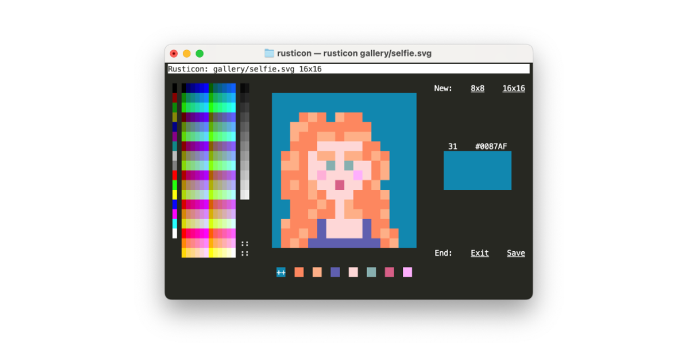
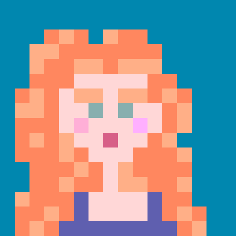
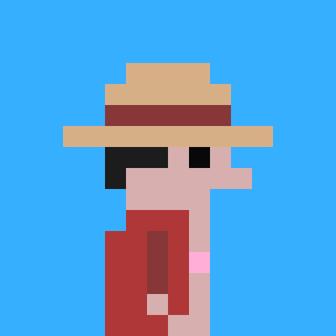
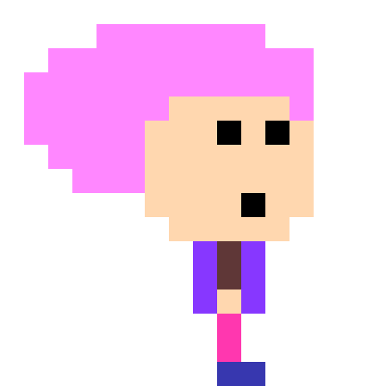
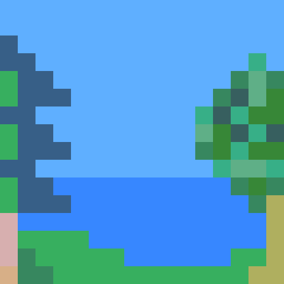
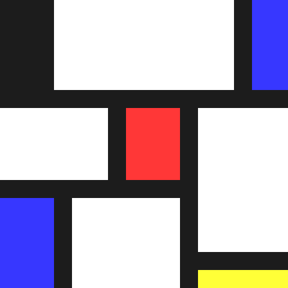

# Rusticon

Rusticon is a mouse driven SVG favicon editor for your terminal.

It creates, and then edits svg images that can be used as website favicons (i.e. the little icons that appear at the top tabs etc.). Icons can be 8 pixels by 8 pixels, or 16 pixels by 16 pixels, utilizing 256 colors. 

It's written in [Rust](https://www.rust-lang.org/).

<p align=center></p>

# Install

## Pre Built Binaries

Pre built binaries are provided for each [release](https://github.com/ronilan/rusticon/releases).

## From crates.io
Rusticon is published as a crate on [crates.io](https://crates.io/crates/rusticon). If you have Cargo, you can install it with
```sh
cargo install rusticon
```

You will be able to invoke the binary as `rusticon`.
```sh
rusticon
```

## From Source
If you don't want to install a Rust crate, but do have Rust installed, you can build and run Rusticon directly from source.

Clone this repository,
```sh
git clone https://github.com/ronilan/rusticon.git
```

```sh
cargo run --release
```

# Use

## Drawing

- Hover over color pickers to see color.
- Click to pick color.
- Click to place them on the canvas.
- Drag to draw multiple pixels.
- Shift, Click for flood fill.
- Palette at bottom allows to "collect colors". Click to choose where to place selected.
- Save to save and exit.
- Exit to exit without save.
- 16x16 to start new icon.
- 8x8 to start new icon.

## Files
- Command line argument to provide file name `rusticon ./icons/favicon.svg` 
- Can open files created by [Rusticon](https://github.com/ronilan/rusticon) (or by [Crubmicon](https://github.com/ronilan/crumbicon)).
- Will abort when file is not created by either of those.

# Gallery

> Made something cool? Make a pull request!



###### Fabriqué au Canada : Made in Canada 🇨🇦