# Rusticon

Rusticon is a mouse driven SVG favicon editor for your terminal (that also works on the web: [Try it out!](https://ronilan.github.io/rusticon/)). 

It creates, and then edits svg images that can be used as website favicons (i.e. the little icons that appear at the top tabs etc.). Icons can be 8 pixels by 8 pixels, or 16 pixels by 16 pixels, utilizing 256 colors. 

It's written in [Rust](https://www.rust-lang.org/) using the [Incredible](https://www.incredible.rs/) TUI framework.

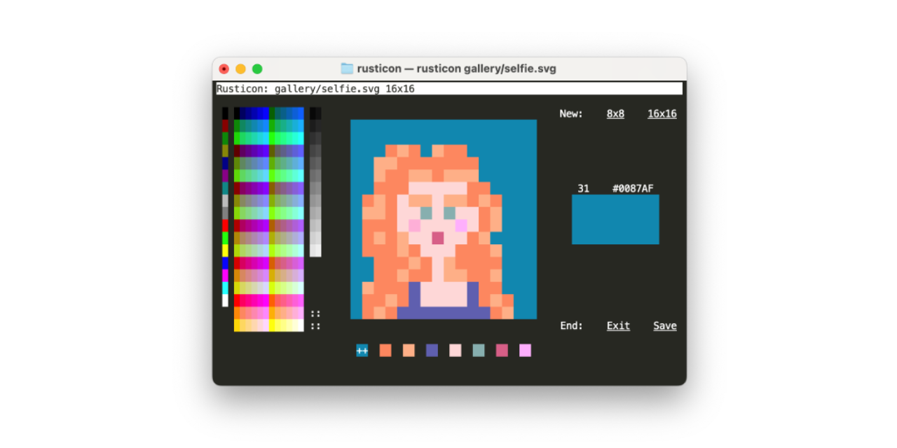

# Install

## Pre Built Binaries

Pre built binaries are provided for each [release](https://github.com/ronilan/rusticon/releases).

## WASM version

Available on web at: https://ronilan.github.io/rusticon/

# Use

## Drawing

- Hover over color pickers to see color.
- Click to pick color.
- Click to place them on the canvas.
- Drag to draw multiple pixels.
- Double-click for flood fill.
- Ctrl + Click to pick color from canvas.
- Palette at bottom allows to "collect colors". Click to choose where to place selected.
- Save to save and exit.
- Exit to exit without save.
- 16x16 to clear and start at 16x16.
- 8x8 to clear and start at 8x8.

## Files
- Command line argument to provide file name `rusticon ./icons/favicon.svg` - or - open file by drag and drop.
- Can open files created by [Rusticon](https://github.com/ronilan/rusticon) (or by [Crubmicon](https://github.com/ronilan/crumbicon)) with `.svg` extension (own format).
- Can open image files. Will resize and resample to 16x16 and then save as `.svg` in own format.
- When provided with a path to non existing file, will create it with `.svg` extension.
- Will abort when file is not a workable image.

# Gallery

> Made something cool? Make a pull request!

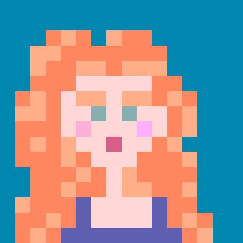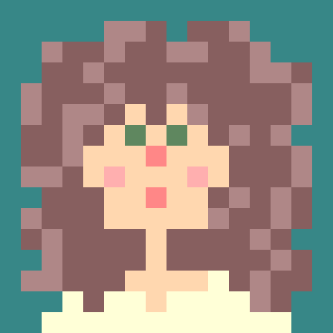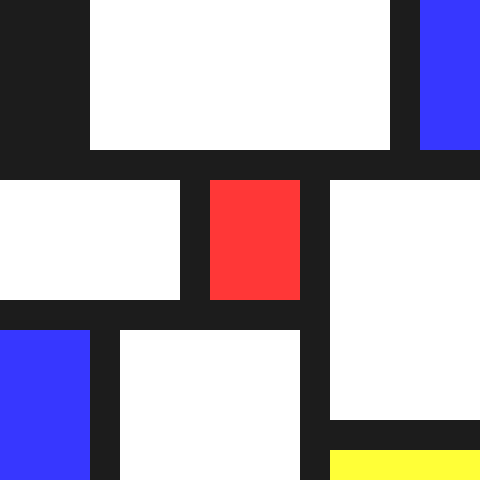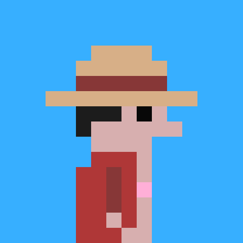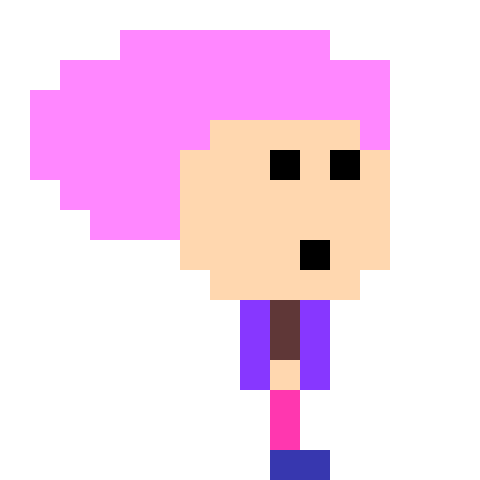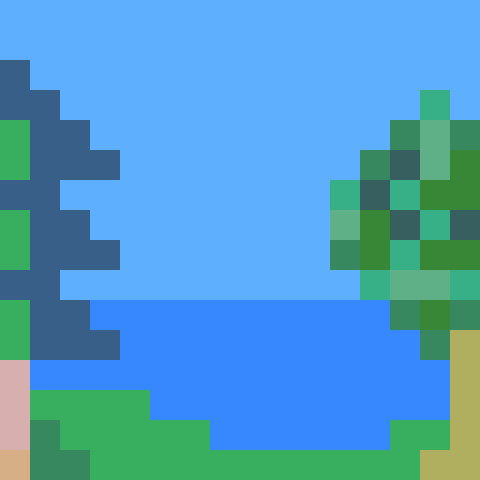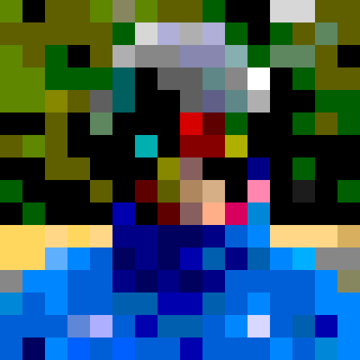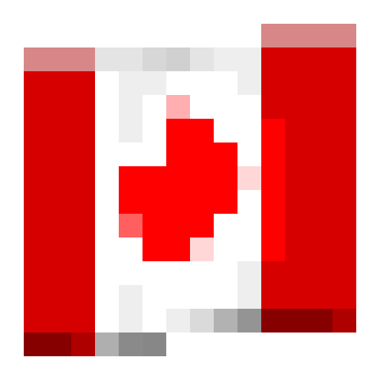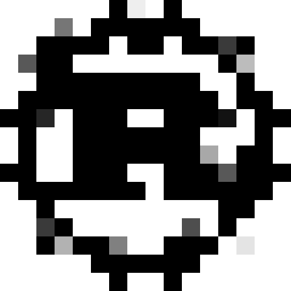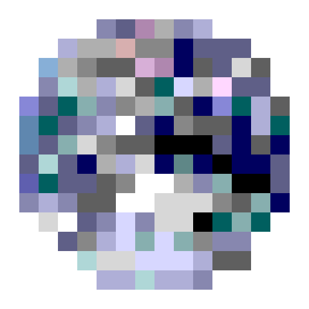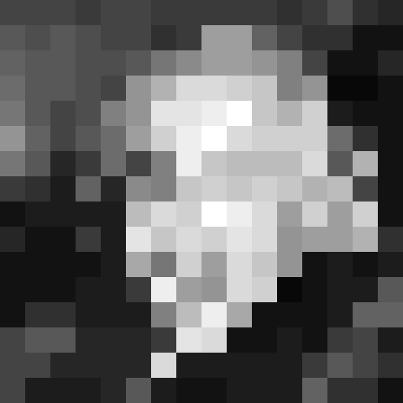

###### Fabriqué au Canada : Made in Canada 🇨🇦
